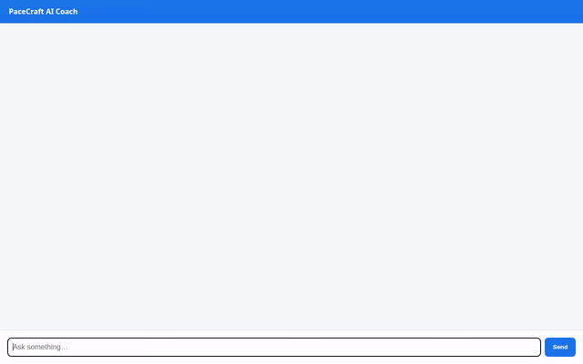

# PaceCraft AI 🏃‍♂️⚡
**Personal Running & Endurance Coach Agent**

PaceCraft AI is an intelligent, agentic AI running and endurance coach built with Google Cloud's **Agent Development Kit (ADK)** and deployed to **Vertex AI Agent Runtime**. It empowers runners with personalized training schedules, heart rate zone calculations, real-time running weather forecasts, grounded botanical remedies, and AI-generated gear visualizations.



---

## 🚀 Implemented Features & Architecture

### 🧠 Core Agent Engine & ADK
- **Framework**: `google-adk` with `Gemini 2.5 Flash` model (`gemini-2.5-flash`).
- **Deployment**: Agent Engine Reasoning Engine on Google Cloud's Vertex AI Agent Runtime (`us-central1`).
- **A2A Protocol**: Native Agent-to-Agent (A2A) protocol communication for streaming and client interactions.

### 💾 Firestore Backend Database
- **Collection**: `training_routines`
- **Function Tools**:
  - `get_training_routines`: Search for training routines by target distance (5K, 10K, Half Marathon, Marathon) and difficulty.
  - `save_training_routine`: Save or update new running schedules with weekly mileage and workout details.

### 🧠 Vertex AI Memory Bank
- Long-term cross-session memory powered by **Vertex AI Memory Bank**.
- Automatically captures and remembers runner profiles, target race distances, finish times, and strict health/dietary/allergy constraints.

### 🌤️ Live Running Weather API
- **Tool**: `get_running_weather_forecast`
- Integrated with the **Open-Meteo Public Forecast API** to fetch real-time outdoor running conditions (temperature, feels-like temperature, humidity, wind speed) given latitude and longitude coordinates.

### 📊 Heart Rate Zone Calculator
- **Tool**: `calculate_heart_rate_zones`
- Computes target heart rate training ranges (Zone 1 Recovery through Zone 5 Anaerobic) using the **Karvonen formula** based on resting and maximum heart rate.

### 🎨 Image & Video Generation & Cloud Storage
- **Tools**:
  - `generate_running_gear_image`: Generates studio product images for running gear using `gemini-3.1-flash-lite-image` in `global` region.
  - `generate_running_video`: Generates short videos for running routines, marathon events, or athletic gear using Google's Omni model (`gemini-omni-flash-preview`) in `global` region.
- **Session & Storage**:
  - Saves generated media as artifacts in the session using `ToolContext.save_artifact` for the Playground's Artifacts panel.
  - Uploads raw bytes directly to public Google Cloud Storage (`pacecraft-ai-assets-*`) without local file writes and returns public HTTPS URLs.

### 📚 Vertex AI RAG Engine Grounding
- **Tool**: `consult_herbal_docs`
- Grounded on Nicholas Culpeper's *The Complete Herbal* using a serverless **Vertex AI RAG Engine** corpus (`herbal-corpus`) for natural endurance remedies, plants, and recovery herbs.

### 💻 Agent Engine Sandbox Code Executor
- Integrates `AgentEngineSandboxCodeExecutor` to safely execute Python code in a sandboxed runtime environment for advanced mathematical calculations, pace distributions, and volume ramp-up percentages.

### 🎴 A2UI Rich Card Display
- Uses `a2ui-agent-sdk` (v0.8) and `a2ui_callback` to emit structured A2UI cards (Cards, Columns, Rows, Text, Images) for clean rendering in supporting web interfaces.

---

## 📋 Planned / Future Enhancements
- `log_run`: Persistent run history logging (planned in initial brief, to be implemented).
- Advanced interactive A2UI buttons and form controls.

---

## 🛠️ Local Development & Running Instructions

### 1. Prerequisites
- Python 3.11+
- Google Cloud SDK (`gcloud`)
- [`uv`](https://docs.astral.sh/uv/) package manager installed

### 2. Environment Setup
```bash
# Clone the repository
git clone https://github.com/YOUR_USERNAME/buildwithgemini-pacecraft-ai.git
cd buildwithgemini-pacecraft-ai

# Install dependencies
uv sync
```

### 3. Run Agent Playground (`adk web`)
```bash
export GOOGLE_GENAI_USE_VERTEXAI=true
export GOOGLE_CLOUD_PROJECT="your-gcp-project-id"
export GOOGLE_CLOUD_LOCATION="us-central1"

uv run adk web --port 8080 --reload_agents
```
Open `http://localhost:8080` in your browser to interact with the agent.

### 4. Run Custom FastAPI Chat Frontend
```bash
cd frontend
export AGENT_ENGINE_RESOURCE_NAME="projects/<PROJECT_NUMBER>/locations/us-central1/reasoningEngines/<RESOURCE_ID>"
export AGENT_DIRECTORY="app"

python main.py
```
Open `http://localhost:8080` to access the chat web UI.

---

## 📄 License
Apache 2.0 License.
